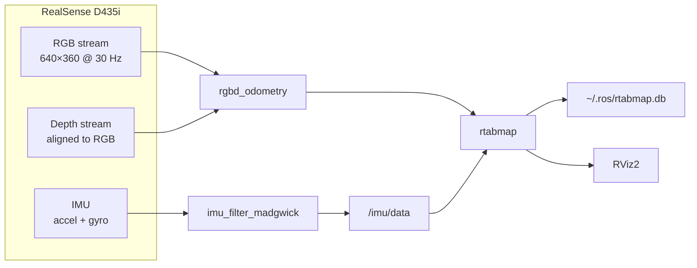

# Visual SLAM Guide — Intel RealSense D435i + RTAB-Map

## Hardware & Software Requirements

| Component | Details |
|---|---|
| Camera | Intel RealSense D435i (USB 3) |
| ROS 2 | Jazzy |
| SLAM | RTAB-Map 4.56 |
| Packages | `realsense2_camera`, `rtabmap_ros`, `imu_filter_madgwick` |

---

## System Architecture



---

## One-Time Setup

### 1. Install dependencies
```bash
sudo apt install ros-jazzy-realsense2-camera \
                 ros-jazzy-rtabmap-ros \
                 ros-jazzy-imu-filter-madgwick \
                 cloudcompare
```

### 2. Verify camera is detected
```bash
rs-enumerate-devices
# Must show: Intel RealSense Depth Camera 435i
```
> If not detected: unplug and replug the USB 3 cable (blue port), then retry.

### 3. Build the package
```bash
cd ~/path/to/Visual-Slam/ros2_ws

# Exclude source realsense (use system-installed version)
touch src/realsense-ros/COLCON_IGNORE

# Remove broken stubs if present
rm -rf install/realsense2_camera install/realsense2_camera_msgs \
       install/realsense2_description install/realsense2_ros_mqtt_bridge

colcon build --packages-select point_cloud anubi_slam
source install/setup.bash
```

---

## Running SLAM

### Fresh map (deletes previous)
```bash
source ~/path/to/Visual-Slam/ros2_ws/install/setup.bash
ros2 launch anubi_slam slam.launch.py
```

### Resume mapping (keeps existing map)
```bash
ros2 launch anubi_slam slam.launch.py delete_db:=false
```

### What starts automatically
| Node | Role |
|---|---|
| `realsense2_camera_node` | Streams RGB, aligned depth, IMU |
| `imu_filter_madgwick_node` | Fuses accel + gyro → quaternion |
| `rgbd_odometry` | Estimates camera motion frame-by-frame |
| `rtabmap` | Builds map, detects loop closures, saves to DB |
| `rviz2` | Live visualization |

---

## Mapping Best Practices

### Check odometry quality first
Watch the terminal for:
```
Odom: quality=87 ...   ← good, start moving
Odom: quality=0  ...   ← tracking lost, stop and recover
```
Wait for `quality > 20` before moving.

### Camera tips
| Do | Don't |
|---|---|
| Point at textured surfaces (books, objects, walls with posters) | Point at blank walls or ceilings |
| Move slowly (~0.3 m/s) | Make fast rotations |
| Keep 70%+ overlap between consecutive views | Jump or shake the camera |
| Return to start position to trigger loop closure | Cover the lens |

### Loop closure
When you return to a previously seen area, a **red edge** appears in the RViz MapGraph panel. This corrects accumulated drift and is essential for an accurate map.

---

## Saving the Map

The map is **saved automatically** to `~/.ros/rtabmap.db` when you press `Ctrl+C`.

To also export as a point cloud file:
```bash
# Export .ply (default output: ~/.ros/rtabmap_cloud.ply)
rtabmap-export --cloud ~/.ros/rtabmap.db

# Export with colour
rtabmap-export --cloud --texture ~/.ros/rtabmap.db

# Save to a custom path
rtabmap-export --cloud --output /path/to/my_map.ply ~/.ros/rtabmap.db
```

To save the map to a specific database path:
```bash
# Set custom DB path in launch
ros2 launch anubi_slam slam.launch.py
# Then edit slam.launch.py and add to rtabmap parameters:
# 'database_path': '/path/to/my_map.db'
```

---

## Viewing the Map

### Option A — RTAB-Map database viewer (recommended, already installed)
```bash
rtabmap-databaseViewer ~/.ros/rtabmap.db
```
Inside the viewer:
- **Edit → View 3D Map** — full coloured point cloud
- **View → Graph** — pose graph with loop closure edges
- **Edit → Export Clouds** — export to .ply/.pcd

### Option B — CloudCompare (best for point cloud inspection)
```bash
CloudCompare ~/.ros/rtabmap_cloud.ply
# or the lightweight viewer:
ccViewer ~/.ros/rtabmap_cloud.ply
```
Useful CloudCompare tools:
- **Edit → Colors → Height Ramp** — colour by height
- **Tools → Statistics** — point density, noise analysis
- **Edit → Subsample** — reduce point count for performance

### Option C — RViz2 live view (during mapping)
RViz2 opens automatically with the launch file. Key displays:

| Panel | Shows |
|---|---|
| **MapCloud** | Growing 3D coloured map |
| **MapGraph** | Pose graph — blue=sequential, red=loop closure |
| **LocalCloud** | What the camera sees right now |
| **Trajectory** | Camera path (green line) |
| **OccupancyMap** | 2D top-down floorplan |
| **TF** | Coordinate frames — smooth motion = good tracking |
| **RGBImage** | Live colour feed |

---

## TF Tree (for debugging)
```bash
ros2 run rqt_tf_tree rqt_tf_tree
```
Expected structure:
```
map
└── odom
    └── camera_link
        ├── camera_color_optical_frame
        ├── camera_depth_optical_frame
        └── camera_imu_optical_frame
```
If `map → odom` is missing, RTAB-Map has not initialised yet (wait for `quality > 0`).

---

## Troubleshooting

### `quality=0` — odometry tracking fails
- Point camera at a **textured scene** (not a blank wall)
- Move more slowly
- Lower `Vis/MinInliers` in `slam.launch.py` (currently set to 10)

### `No RealSense devices were found`
```bash
# Reload udev rules
sudo udevadm control --reload-rules && sudo udevadm trigger
# Unplug and replug the camera, then retry
rs-enumerate-devices
```

### `source install/setup.bash` warns about missing realsense path
```bash
touch ~/path/to/Visual-Slam/ros2_ws/src/realsense-ros/COLCON_IGNORE
rm -rf ~/path/to/Visual-Slam/ros2_ws/install/realsense2_camera
colcon build --packages-select anubi_slam
```

### Build fails with `No module named 'catkin_pkg'`
```bash
~/path/to/Visual-Slam/ros2_ws/src/myenv/bin/pip install catkin_pkg lark empy
rm -rf ~/path/to/Visual-Slam/ros2_ws/build/point_cloud
colcon build --packages-select point_cloud anubi_slam
```
